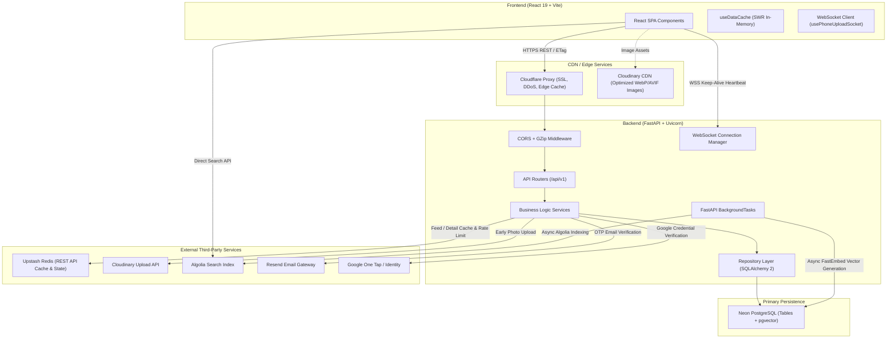

# SetupSpot — System Architecture & Design Patterns

SetupSpot is engineered using a decoupled, layered architecture prioritizing ultra-fast page loads, progressive rendering, background job processing, and multi-tier caching.

---

## 🏛️ System Architecture Overview

---

## 📂 Folder & Module Map

### 1. Backend Codebase (`/backend`)

| Directory / File | Core Responsibility | Key Code Symbols |
| :--- | :--- | :--- |
| [`api/routers/`](file:///home/creeksonjoseph/softwarengineering/personal-projects/SetupSpot/backend/api/routers) | HTTP presentation layer, endpoint routing, dependency injection | [`setups.py`](file:///home/creeksonjoseph/softwarengineering/personal-projects/SetupSpot/backend/api/routers/setups.py), [`auth.py`](file:///home/creeksonjoseph/softwarengineering/personal-projects/SetupSpot/backend/api/routers/auth.py), [`mobile_upload.py`](file:///home/creeksonjoseph/softwarengineering/personal-projects/SetupSpot/backend/api/routers/mobile_upload.py) |
| [`services/`](file:///home/creeksonjoseph/softwarengineering/personal-projects/SetupSpot/backend/services) | Pure business logic, cache invalidation, workflow orchestration | [`setup_service.py`](file:///home/creeksonjoseph/softwarengineering/personal-projects/SetupSpot/backend/services/setup_service.py), [`auth_service.py`](file:///home/creeksonjoseph/softwarengineering/personal-projects/SetupSpot/backend/services/auth_service.py), [`recommendation_service.py`](file:///home/creeksonjoseph/softwarengineering/personal-projects/SetupSpot/backend/services/recommendation_service.py) |
| [`transactions/`](file:///home/creeksonjoseph/softwarengineering/personal-projects/SetupSpot/backend/transactions) | Repository layer executing database queries & joined eager loading | [`setup_repo.py`](file:///home/creeksonjoseph/softwarengineering/personal-projects/SetupSpot/backend/transactions/setup_repo.py), [`user_repo.py`](file:///home/creeksonjoseph/softwarengineering/personal-projects/SetupSpot/backend/transactions/user_repo.py), [`item_repo.py`](file:///home/creeksonjoseph/softwarengineering/personal-projects/SetupSpot/backend/transactions/item_repo.py) |
| [`models/`](file:///home/creeksonjoseph/softwarengineering/personal-projects/SetupSpot/backend/models) | SQLAlchemy ORM entity definitions & database schema declarations | [`setup.py`](file:///home/creeksonjoseph/softwarengineering/personal-projects/SetupSpot/backend/models/setup.py), [`user.py`](file:///home/creeksonjoseph/softwarengineering/personal-projects/SetupSpot/backend/models/user.py), [`embedding.py`](file:///home/creeksonjoseph/softwarengineering/personal-projects/SetupSpot/backend/models/embedding.py) |
| [`core/`](file:///home/creeksonjoseph/softwarengineering/personal-projects/SetupSpot/backend/core) | Core configuration, security helpers, DB engine, SDK client singletons | [`redis_client.py`](file:///home/creeksonjoseph/softwarengineering/personal-projects/SetupSpot/backend/core/redis_client.py), [`security.py`](file:///home/creeksonjoseph/softwarengineering/personal-projects/SetupSpot/backend/core/security.py), [`config.py`](file:///home/creeksonjoseph/softwarengineering/personal-projects/SetupSpot/backend/core/config.py) |

### 2. Frontend Codebase (`/frontend`)

| Directory / File | Core Responsibility | Key Code Symbols |
| :--- | :--- | :--- |
| [`src/Pages/`](file:///home/creeksonjoseph/softwarengineering/personal-projects/SetupSpot/frontend/src/Pages) | Page view routing components | [`ExplorePage.jsx`](file:///home/creeksonjoseph/softwarengineering/personal-projects/SetupSpot/frontend/src/Pages/ExplorePage.jsx), [`PostDetailPage.jsx`](file:///home/creeksonjoseph/softwarengineering/personal-projects/SetupSpot/frontend/src/Pages/PostDetailPage.jsx), [`Create.jsx`](file:///home/creeksonjoseph/softwarengineering/personal-projects/SetupSpot/frontend/src/Pages/Create.jsx) |
| [`src/components/`](file:///home/creeksonjoseph/softwarengineering/personal-projects/SetupSpot/frontend/src/components) | UI presentation components | [`SetupImageCanvas.jsx`](file:///home/creeksonjoseph/softwarengineering/personal-projects/SetupSpot/frontend/src/components/SetupImageCanvas.jsx), [`PostSocialBar.jsx`](file:///home/creeksonjoseph/softwarengineering/personal-projects/SetupSpot/frontend/src/components/PostSocialBar.jsx) |
| [`src/context/`](file:///home/creeksonjoseph/softwarengineering/personal-projects/SetupSpot/frontend/src/context) | React Context global state providers | [`AuthContext.jsx`](file:///home/creeksonjoseph/softwarengineering/personal-projects/SetupSpot/frontend/src/context/AuthContext.jsx), [`ToastContext.jsx`](file:///home/creeksonjoseph/softwarengineering/personal-projects/SetupSpot/frontend/src/context/ToastContext.jsx) |
| [`src/hooks/`](file:///home/creeksonjoseph/softwarengineering/personal-projects/SetupSpot/frontend/src/hooks) | Stateful custom hooks & data fetching logic | [`useSetups.js`](file:///home/creeksonjoseph/softwarengineering/personal-projects/SetupSpot/frontend/src/hooks/useSetups.js), [`useCreateSetup.js`](file:///home/creeksonjoseph/softwarengineering/personal-projects/SetupSpot/frontend/src/hooks/useCreateSetup.js), [`useAuthFetch.js`](file:///home/creeksonjoseph/softwarengineering/personal-projects/SetupSpot/frontend/src/hooks/useAuthFetch.js) |

---

## 🔄 Trace: Real Request Flow (`POST /setups`)

Below is the step-by-step execution path when a user creates a new setup post:

1. **Early Upload**: User picks a photo -> Frontend immediately POSTs file to `POST /api/early-upload` ([`early_upload.py`](file:///home/creeksonjoseph/softwarengineering/personal-projects/SetupSpot/backend/api/routers/early_upload.py#L25)). Backend uploads image to Cloudinary and returns hosted CDN URL string.
2. **Draft Saving**: As the user adds pins, `useCreateSetup` saves state to `localStorage` via `useSetupDraft` ([`useCreateSetup.js`](file:///home/creeksonjoseph/softwarengineering/personal-projects/SetupSpot/frontend/src/hooks/useCreateSetup.js#L96)).
3. **Form Submission**: User clicks "Post Setup" -> Frontend sends `POST /setups` with JSON payload + pre-uploaded CDN image URL ([`setups.py`](file:///home/creeksonjoseph/softwarengineering/personal-projects/SetupSpot/backend/api/routers/setups.py#L93)).
4. **Auth Validation**: `get_current_user` extracts JWT from HTTP-only cookie, decodes user ID, and checks token revocation status in Redis ([`dependencies.py`](file:///home/creeksonjoseph/softwarengineering/personal-projects/SetupSpot/backend/api/dependencies.py#L32)).
5. **Database Transaction**: `setup_service.create_setup` creates setup row + annotated `Item` rows in PostgreSQL within a single transaction ([`setup_service.py`](file:///home/creeksonjoseph/softwarengineering/personal-projects/SetupSpot/backend/services/setup_service.py#L73)).
6. **Cache Invalidation**: `redis_client.invalidate_explore_setups()` purges cached feed pages ([`setup_service.py`](file:///home/creeksonjoseph/softwarengineering/personal-projects/SetupSpot/backend/services/setup_service.py#L95)).
7. **HTTP 201 Response**: Server responds immediately (`~100ms`).
8. **Background Task Offloading**: After response is dispatched, FastAPI executes `background_index_setup`:
   - Indexes setup metadata in **Algolia** ([`algolia_service.py`](file:///home/creeksonjoseph/softwarengineering/personal-projects/SetupSpot/backend/services/algolia_service.py#L22)).
   - Generates 384-dim vector embedding via **FastEmbed** and saves to **`pgvector`** ([`recommendation_service.py`](file:///home/creeksonjoseph/softwarengineering/personal-projects/SetupSpot/backend/services/recommendation_service.py#L51)).

---

## ⚡ Key Architectural Patterns Implemented

### 1. Keyset / Cursor Pagination (`WHERE id < cursor`)
- **Location**: [`setup_repo.py`](file:///home/creeksonjoseph/softwarengineering/personal-projects/SetupSpot/backend/transactions/setup_repo.py#L37-L41)
- **Pattern**: Replaces inefficient SQL `OFFSET` with keyset filter `WHERE setup.id < cursor ORDER BY setup.id DESC LIMIT 48`. Guarantees constant $O(\log N)$ query time regardless of feed depth.

### 2. Multi-Layer Caching Strategy
- **Location**: [`redis_client.py`](file:///home/creeksonjoseph/softwarengineering/personal-projects/SetupSpot/backend/core/redis_client.py#L1-L150) & [`useDataCache.js`](file:///home/creeksonjoseph/softwarengineering/personal-projects/SetupSpot/frontend/src/hooks/useDataCache.js#L1-L80)
- **Pattern**: 
  - **Server-Side**: Upstash Redis REST API caches explore feed (`setups:feed:...`), setup detail pages (`setup_detail:{id}`), and similar setups (`similar:{id}:page:{p}`).
  - **Client-Side**: SWR in-memory cache stores responses with ETag validation. On return navigation, renders immediately from memory while validating HTTP 304 in background.

### 3. N+1 Query Elimination (Joined Eager Loading)
- **Location**: [`setup_repo.py`](file:///home/creeksonjoseph/softwarengineering/personal-projects/SetupSpot/backend/transactions/setup_repo.py#L29-L35)
- **Pattern**: Uses SQLAlchemy `joinedload(Setup.user)` (single SQL `JOIN` for authors) and `selectinload(Setup.likes)` / `selectinload(Setup.items)` (batch `IN` queries). Reduces $N+1$ queries down to 1 query.

### 4. HTTP ETags & GZip Compression
- **Location**: [`setups.py`](file:///home/creeksonjoseph/softwarengineering/personal-projects/SetupSpot/backend/api/routers/setups.py#L17-L31) & [`main.py`](file:///home/creeksonjoseph/softwarengineering/personal-projects/SetupSpot/backend/main.py#L60)
- **Pattern**: Calculates MD5 hash of response JSON. If browser sends matching `If-None-Match`, returns `304 Not Modified` (0 body bytes). `GZipMiddleware` automatically compresses payloads $\ge 500$ bytes.
