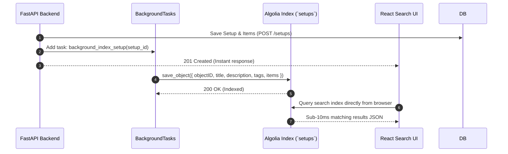

# Integration: Algolia Search Engine

Algolia provides instant, sub-millisecond full-text search indexing across setups, tags, categories, and author profiles.

---

## Connection & Client Wiring

- **Backend Service**: [`algolia_service.py`](file:///home/creeksonjoseph/softwarengineering/personal-projects/SetupSpot/backend/services/algolia_service.py)
- **Frontend Search Page**: [`SearchPage.jsx`](file:///home/creeksonjoseph/softwarengineering/personal-projects/SetupSpot/frontend/src/Pages/SearchPage.jsx)
- **Python SDK**: `algoliasearch` (`SearchClient.create`)
- **JS SDK**: `algoliasearch` (`lite` client for InstantSearch)

---

## Environment Variables Required

**Backend** (`backend/.env`):
```ini
ALGOLIA_APP_ID=82D9UQ8ZF3
ALGOLIA_WRITE_API_KEY=your_admin_write_api_key
ALGOLIA_INDEX_NAME=setups
```

**Frontend** (`frontend/.env`):
```ini
VITE_ALGOLIA_APP_ID=82D9UQ8ZF3
VITE_ALGOLIA_SEARCH_KEY=your_public_search_only_key
VITE_ALGOLIA_INDEX_NAME=setups
```

---

## Data Flow



---

## Failure Behavior & Fallbacks

- **Async Offloading**: Algolia operations run strictly inside FastAPI `BackgroundTasks`. An Algolia network failure or outage will never block or crash user HTTP requests.
- **Database Search Fallback**: If Algolia credentials are not provided or search index is unavailable, frontend falls back to querying SQL `LIKE` search endpoints directly from PostgreSQL.

---

## Gotchas

- **Backfill Script**: When deploying a fresh database, run `python backend/scripts/backfill_algolia.py` to index all existing setups into Algolia.
- **Public API Keys**: Never expose `ALGOLIA_WRITE_API_KEY` in frontend code. Only expose the `VITE_ALGOLIA_SEARCH_KEY` (search-only key) to client applications.
