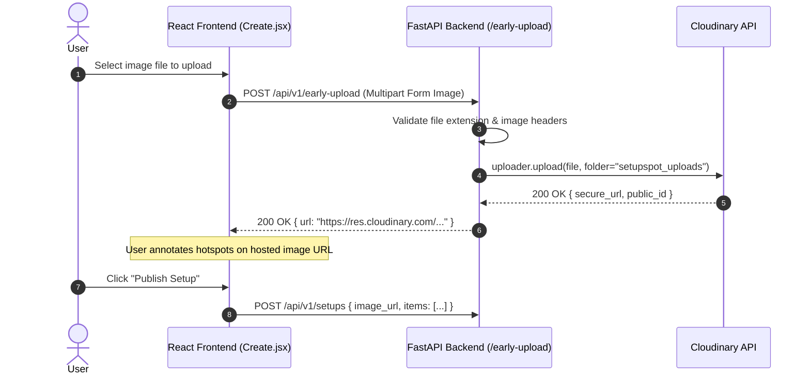

# Integration: Cloudinary Image Service

Cloudinary hosts, optimizes, and serves all setup images, profile photos, and product item imagery across SetupSpot via CDN.

---

## Connection & Client Wiring

- **Module**: [`backend/core/cloudinary_client.py`](file:///home/creeksonjoseph/softwarengineering/personal-projects/SetupSpot/backend/core/cloudinary_client.py)
- **Early Upload Endpoint**: `POST /api/v1/early-upload` ([`early_upload.py`](file:///home/creeksonjoseph/softwarengineering/personal-projects/SetupSpot/backend/api/routers/early_upload.py))
- **SDK**: `cloudinary` (`cloudinary.uploader.upload`)

---

## Environment Variables Required

Configure in `backend/.env`:

```ini
CLOUDINARY_CLOUD_NAME=your_cloud_name
CLOUDINARY_API_KEY=123456789012345
CLOUDINARY_API_SECRET=aBcDeFgHiJkLmNoPqRsTuVwXyZ
CLOUDINARY_UPLOAD_PRESET=SetupSpot
```

---

## Data Flow & Early Upload Pattern



---

## Failure Behavior & Fallbacks

- **File Validation**: Backend rejects non-image mime types or files exceeding size limits before attempting Cloudinary upload.
- **Upload Failures**: If Cloudinary API returns an error or times out, endpoint raises `500 Internal Server Error` with detail `"Image upload failed"`.

---

## Gotchas

- **Early Upload Cleanup**: If a user uploads an image via early-upload but abandons the creation form without saving the post, the uploaded image remains in Cloudinary. Implement a periodic background cleanup script to prune unreferenced Cloudinary images older than 24 hours if storage quota becomes an issue.
