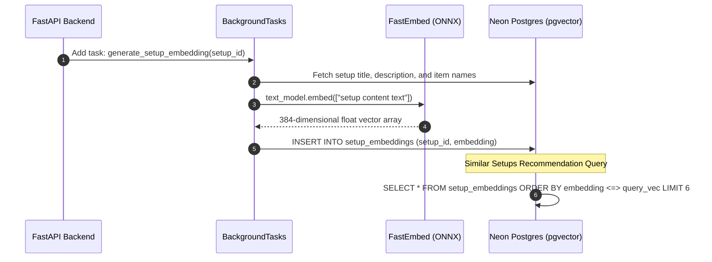

# Integration: FastEmbed & pgvector Embeddings

FastEmbed generates high-dimensional vector embeddings of setup titles, descriptions, and product tags locally in Python. Vectors are stored in PostgreSQL using the `pgvector` extension for cosine similarity recommendations.

---

## Connection & Engine Wiring

- **Module**: [`recommendation_service.py`](file:///home/creeksonjoseph/softwarengineering/personal-projects/SetupSpot/backend/services/recommendation_service.py)
- **Model**: `BAAI/bge-small-en-v1.5` (384 dimensions, ONNX runtime)
- **ORM Extension**: `pgvector.sqlalchemy` (`Vector(384)`)
- **Initialization**:
  ```python
  from fastembed import TextEmbedding

  # Singleton model instance loaded into memory on demand
  _embedding_model = TextEmbedding(model_name="BAAI/bge-small-en-v1.5")
  ```

---

## Environment Variables & Dependencies Required

Requires `fastembed` and `pgvector` in `pyproject.toml`:

```toml
dependencies = [
    "fastembed>=0.8.0",
    "pgvector>=0.5.0",
]
```

PostgreSQL database MUST have the `pgvector` extension installed:
```sql
CREATE EXTENSION IF NOT EXISTS vector;
```

---

## Data Flow



---

## Failure Behavior & Fallbacks

- **CPU ONNX Runtime**: FastEmbed runs ONNX model inference locally on CPU without requiring an external paid OpenAI/Cohere API or GPU server.
- **Graceful Fallback**: If vector generation fails or `pgvector` extension is absent, `recommendation_service` falls back to returning recent setups from the same category.

---

## Gotchas

- **First Ingestion Latency**: The ONNX model weights (`~130MB`) are downloaded automatically on first model instantiation. In production, pre-download model weights during Docker build step or cold start to prevent request delays.
