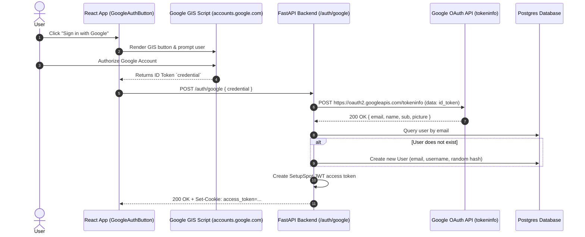

# Integration: Google OAuth (Google Identity Services / One Tap)

Google Identity Services provides one-tap login and passwordless OAuth authentication for SetupSpot users.

---

## Connection & Client Wiring

- **Frontend Component**: [`GoogleAuthButton.jsx`](file:///home/creeksonjoseph/softwarengineering/personal-projects/SetupSpot/frontend/src/components/GoogleAuthButton.jsx)
- **Backend Router**: `POST /api/v1/auth/google` in [`auth.py`](file:///home/creeksonjoseph/softwarengineering/personal-projects/SetupSpot/backend/api/routers/auth.py#L59)
- **Backend Verification**: `auth_service.google_login` in [`auth_service.py`](file:///home/creeksonjoseph/softwarengineering/personal-projects/SetupSpot/backend/services/auth_service.py#L211)

---

## Environment Variables Required

**Backend** (`backend/.env`):
```ini
GOOGLE_CLIENT_ID=your_google_client_id.apps.googleusercontent.com
GOOGLE_CLIENT_SECRET=your_google_client_secret
```

**Frontend** (`frontend/.env`):
```ini
VITE_GOOGLE_CLIENT_ID=your_google_client_id.apps.googleusercontent.com
```

---

## Data Flow



---

## Failure Behavior & Fallbacks

- If `GOOGLE_CLIENT_ID` is missing in backend env, endpoint returns `500 Internal Server Error` stating "Google OAuth is not configured".
- If ID token is invalid or expired, Google `tokeninfo` returns 400/401, causing backend to raise `401 Unauthorized`.
- Standard email/password registration remains available if Google OAuth fails.

---

## Gotchas

- **Cross-Origin Opener Policy (COOP)**: Third-party cookies or popup blockers can occasionally block Google One Tap. The frontend falls back to standard Google Sign-In button rendering if One Tap is blocked.
- **Email Case Normalization**: Always convert `email` from Google to `.strip().lower()` before querying the database to prevent duplicate user accounts.
