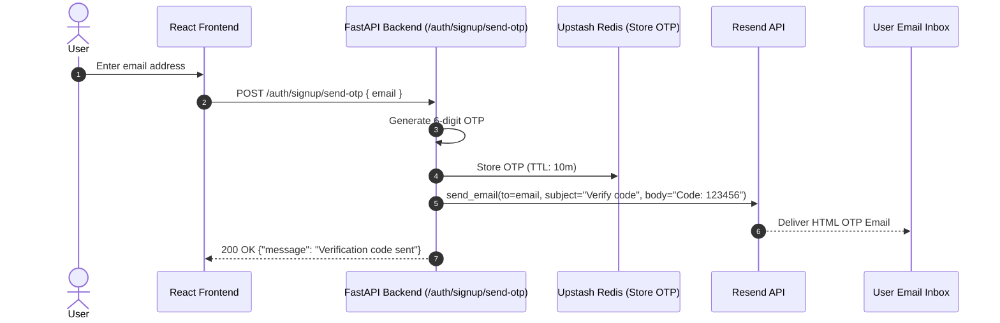

# Integration: Resend Email Gateway

Resend delivers transactional emails, including 6-digit OTP verification codes for passwordless signup and password reset.

---

## Connection & Client Wiring

- **Module**: [`backend/core/email.py`](file:///home/creeksonjoseph/softwarengineering/personal-projects/SetupSpot/backend/core/email.py)
- **SDK**: `resend` (`resend.Emails.send`)
- **Initialization**:
  ```python
  import resend
  from core.config import settings

  resend.api_key = settings.RESEND_API_KEY
  ```

---

## Environment Variables Required

Configure in `backend/.env`:

```ini
RESEND_API_KEY=re_123456789_abcdefghijklmnopqrstuvwxyz
```

---

## Data Flow



---

## Failure Behavior & Fallbacks

- **Development Sandbox Limitation**: In Resend's free sandbox tier without a verified custom domain, emails can only be sent to the account owner's email address.
- **Graceful Error Handling**: If Resend API fails (e.g. invalid key or unverified recipient), `send_otp_email` logs the exception. In dev environments, the generated OTP is logged to backend stdout so developers can complete the signup flow without email delivery.

---

## Gotchas

- **Spam Filter Messaging**: Always inform users to check their spam folder when prompting for OTP entry (`"Verification code sent. Check your spam folder."`).
