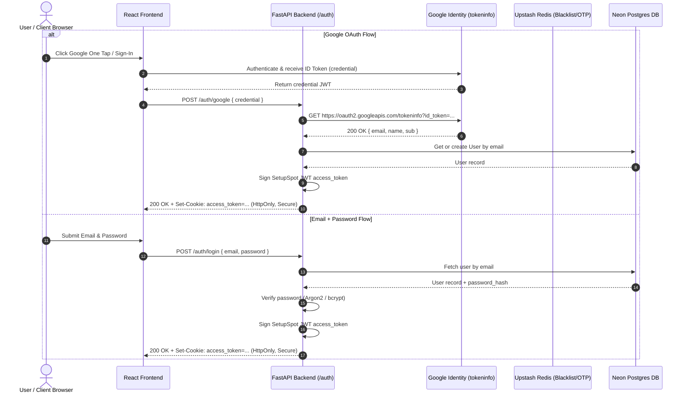

# SetupSpot — Security Architecture & Threat Model

This document outlines the security controls, authentication mechanisms, token lifecycles, and access control policies implemented across SetupSpot.

---

## Authentication Architecture

SetupSpot supports three distinct authentication pathways:

1. **Email + OTP Verification (Passwordless Signup/Reset)**:
   - Frontend requests OTP -> Backend generates 6-digit numeric code ([`auth_service.py`](file:///home/creeksonjoseph/softwarengineering/personal-projects/SetupSpot/backend/services/auth_service.py#L115)).
   - Code is stored in Upstash Redis with a 10-minute TTL (`ttl_seconds=600`).
   - Code is delivered to the user via **Resend API**.
2. **Email + Password Login**:
   - User credentials verified against database `password_hash`.
   - Passwords hashed using **Argon2id** (`argon2-cffi`) with **bcrypt** legacy fallback ([`security.py`](file:///home/creeksonjoseph/softwarengineering/personal-projects/SetupSpot/backend/core/security.py)).
3. **Google One Tap / OAuth 2.0 Token Exchange**:
   - Google GSI button issues a Google ID Token (`credential`) on the client ([`GoogleAuthButton.jsx`](file:///home/creeksonjoseph/softwarengineering/personal-projects/SetupSpot/frontend/src/components/GoogleAuthButton.jsx#L25)).
   - Backend exchanges `credential` with Google API endpoint `https://oauth2.googleapis.com/tokeninfo` ([`auth_service.py`](file:///home/creeksonjoseph/softwarengineering/personal-projects/SetupSpot/backend/services/auth_service.py#L214)).
   - If valid, auto-creates or matches the user by verified email and issues a signed SetupSpot JWT session cookie.

---

## Session & Token Handling

- **Token Storage**: JWT stored inside an **HTTP-only, Secure, SameSite=Lax** cookie named `access_token` ([`security.py`](file:///home/creeksonjoseph/softwarengineering/personal-projects/SetupSpot/backend/core/security.py#L24-L32)). JavaScript cannot access the token (XSS protection).
- **Token Signature**: HMAC-SHA256 (`HS256`) signed with backend `SECRET_KEY`.
- **Token Expiry**: Configured via `ACCESS_TOKEN_EXPIRE_MINUTES` (Default: 10080 minutes / 7 days).
- **Token Revocation (Logout)**: Calling `POST /auth/logout` adds token string to Upstash Redis blacklist key `revoked:<token>` for the remainder of its TTL ([`security.py`](file:///home/creeksonjoseph/softwarengineering/personal-projects/SetupSpot/backend/core/security.py#L39-L47)). Every request checks `redis_client.get_json(f"revoked:{token}")`.

---

## Authorization & Access Control

- **Resource Ownership Verification**: Write/Delete endpoints verify that resource `user_id` matches the authenticated `current_user.id`:
  - `PUT /setups/{id}`: [`setup_service.py`](file:///home/creeksonjoseph/softwarengineering/personal-projects/SetupSpot/backend/services/setup_service.py#L116) raises `403 Forbidden` if `setup.user_id != user_id`.
  - `DELETE /setups/{id}`: [`setup_service.py`](file:///home/creeksonjoseph/softwarengineering/personal-projects/SetupSpot/backend/services/setup_service.py#L175) raises `403 Forbidden` if `setup.user_id != user_id`.
  - `DELETE /collections/{id}`: [`collection_service.py`](file:///home/creeksonjoseph/softwarengineering/personal-projects/SetupSpot/backend/services/collection_service.py#L85) enforces ownership.
- **Admin Role Enforcement**: Admin endpoints in [`admin.py`](file:///home/creeksonjoseph/softwarengineering/personal-projects/SetupSpot/backend/api/routers/admin.py#L22) check `if not current_user.is_admin: raise HTTPException(403)`.

---

## Secrets Management & API Protection

- **Environment Variables**: Managed via `pydantic-settings` ([`config.py`](file:///home/creeksonjoseph/softwarengineering/personal-projects/SetupSpot/backend/core/config.py#L5-L23)). `.env` files are ignored in `.gitignore`.
- **Rate Limiting**: Sliding window rate limits stored in Upstash Redis ([`redis_client.py`](file:///home/creeksonjoseph/softwarengineering/personal-projects/SetupSpot/backend/core/redis_client.py#L124)):
  - OTP Requests: Max 4 attempts per 15 minutes per email.
  - Login Attempts: Max 10 attempts per 15 minutes per email.
  - **Dynamic TTL Calculation**: When a limit is hit, the backend queries Redis TTL and calculates remaining wait minutes (`detail: "Too many attempts. Please wait 14 minutes."`). This ensures users receive identical remaining wait times across tabs and browser restarts.
- **CORS Protection**: Origin validation restricted to explicit origins in `cors_origins` ([`main.py`](file:///home/creeksonjoseph/softwarengineering/personal-projects/SetupSpot/backend/main.py#L35-L45)).
- **Input Validation & Image Sanitization**: Pydantic schemas enforce type validation. Image early uploads enforce content checks.

---

## Verified Security Checklist

> [!NOTE]
> 1. **Google OAuth Audience (`aud`) Validation**: Enforced in [`auth_service.py`](file:///home/creeksonjoseph/softwarengineering/personal-projects/SetupSpot/backend/services/auth_service.py#L229) to ensure Google ID tokens match `GOOGLE_CLIENT_ID`.
> 2. **Configurable Admin Email**: Configure `ADMIN_EMAIL=your_email@domain.com` in `backend/.env` (or set `is_admin = True` in DB) without hardcoding email strings in code.
> 3. **Default Secret Key Fallback**: Ensure `SECRET_KEY` in `backend/.env` is set to a secure random string in production environments.
